# FaustBot-llm-vtuber

---

### 一个AI驱动的 Vtuber/桌宠

**仍然处于早期开发阶段**

---

### 功能列表

- [x] 多AGENT支持

- [x] ASR 语音识别

- [x] TTS 人声输出

- [x] 音乐播放（唱歌）

- [x] 模型记忆系统(基于RAG)

- [x] 每个Agent单独的Workspace

- [x] (独创)灵动交互系统 (前端HTML小窗口交互)

- [x] 编辑文件，文件读写等基本工具

- [x] 调用VLM操作用户电脑

- [x] 在线搜索

- [x] AI 玩 Minecraft (基于Mineflyer构建，无缝体验)

- [x] 读取屏幕内容

- [x] 高速响应 平均时间<1s

- [x] 插件系统 [插件市场](https://liwusen.github.io/FaustBot-llm-vtuber/)

- [x] 兼容Openclaw Skill && Clawhub 技能

- [x] 操作网页 (Agent Browser)

- [ ] 给予AI单独的一个可交互Console

- [ ] MCP协议支持

- [ ] 安全系统，限制Agent的访问权限，并对模型命令进行审核

---

### 功能计划(长期)

| 大饼          | 解释                 | 预计时间        |
| ----------- | ------------------ | ----------- |
| Minecraft   | 使用Mineflyer，从底层完成  | 完成          |
| 原创Live 2d形象 |                    | 待定          |
| TTS 歌曲转换    |                    |             |
| 游览器 操作      | Agent Browser 能力接入 | 完成(Skill系统) |
| OCR/VLLM支持  |                    | 部分完成        |
| 前端优化        |                    | 完成          |
| 灵动交互        | 允许AI编写HTML实现交互     | 完成          |

---

### 原角色设定

> 浮士德 （FAUST）是《边狱公司》及其衍生作品的登场角色。 原型来源歌剧 《浮士德》。 该罪人为我司巴士打造了“梅菲斯特号”引擎。 她声称自己是都市中最聪慧的存在，没有人能在智慧层面上与她相媲美，这可能并非谬论。 当她应允与您交谈时，您会发现她的态度高高在上，令人不悦。 她对待所有人都有一股微妙的傲慢态度，这似乎永远都无法改变了，因此，我们建议您只要应付一下，点点头就成。

来源于游戏《Limbus Company》,引用自[边狱公司中文维基](https://limbuscompany.huijiwiki.com/wiki/%E9%A6%96%E9%A1%B5)

---

### 

### 技术实现

```mermaid
flowchart TD
    %% =========================
    %% 1) 外部输入层
    %% =========================
    subgraph A[外部输入与事件源]
        A1[用户文本输入]
        A2[语音输入 ASR]
        A3[Minecraft 事件]
        A4[定时/间隔/表达式触发]
        A5[Nimble 回调提交/关闭]
        A6[配置中心操作]
        A7[插件市场/技能管理请求]
    end

    %% =========================
    %% 2) 后端入口与运行时
    %% =========================
    subgraph B[后端主入口与运行时]
        B1[启动应用]
        B2[加载公开/私密配置]
        B3[加载 Agent 人设与任务上下文]
        B4[初始化 Checkpoint/Store]
        B5[加载插件并组装 Tool/Middleware]
        B6[启动触发器 Watchdog]
        B7[启动插件心跳循环]
        B8[启动子服务管理器]
        B9[构建 Agent Runtime]
    end

    B1 --> B2 --> B3 --> B4 --> B5 --> B6 --> B7 --> B8 --> B9

    %% =========================
    %% 3) API/WS 入口层
    %% =========================
    subgraph C[接口入口层]
        C1[聊天 WebSocket]
        C2[聊天 HTTP 兼容接口]
        C3[命令 WebSocket]
        C4[Nimble 回调接口]
        C5[配置中心管理接口]
        C6[插件/技能/触发器管理接口]
        C7[RAG 文档管理接口]
    end

    A1 --> C1
    A2 --> C1
    A5 --> C4
    A6 --> C5
    A7 --> C6
    C6 --> C7
    C5 --> C7
    A3 --> D5
    A4 --> D5

    %% =========================
    %% 4) 聊天主链路
    %% =========================
    subgraph D[聊天与调度主链路]
        D1[会话输入标准化]
        D2[设置忽略触发器标记]
        D3[Agent 流式/非流式推理]
        D4[回复聚合与输出]
        D5[触发器入队与取队执行]
        D6[清理忽略触发器标记]
        D7[聊天记录增量同步任务]
    end

    C1 --> D1 --> D2 --> D3 --> D4 --> D6
    C2 --> D1
    C3 --> D5 --> D3
    D4 --> D7

    %% =========================
    %% 5) Agent 工具层
    %% =========================
    subgraph E[Agent 工具调用层]
        E1[系统与时间工具]
        E2[文件读写与补丁工具]
        E3[RAG 同步查询工具]
        E4[RAG 异步查询工具]
        E5[Minecraft 控制工具]
        E6[Nimble 窗口工具]
        E7[触发器 CRUD 工具]
        E8[GUI 操作工具]
        E9[音频播放/表现工具]
        E10[HIL 人工确认]
    end

    D3 --> E1
    D3 --> E2
    D3 --> E3
    D3 --> E4
    D3 --> E5
    D3 --> E6
    D3 --> E7
    D3 --> E8
    D3 --> E9
    D3 --> E10

    %% =========================
    %% 6) RAG 数据链路
    %% =========================
    subgraph F[RAG 数据流]
        F1[RAG 客户端]
        F2[RAG 服务查询/插入]
        F3[文档追踪器]
        F4[会话记录落盘]
        F5[增量索引]
        F6[异步查询结果缓存]
        F7[异步完成触发器]
    end

    E3 --> F1 --> F2
    E4 --> F1 --> F2
    D7 --> F4 --> F5 --> F2
    F1 --> F3
    E4 --> F6 --> F7 --> D5

    %% =========================
    %% 7) Nimble 交互闭环
    %% =========================
    subgraph G[Nimble 闭环]
        G1[创建 Nimble 会话]
        G2[推送窗口展示指令]
        G3[用户提交/关闭]
        G4[写入结果与会话状态]
        G5[创建 result/reminder/expire 触发器]
        G6[触发器唤醒 Agent 继续处理]
    end

    E6 --> G1 --> G2
    G1 --> G5 --> D5
    A5 --> G3 --> G4 --> G6 --> D5
    C4 --> G4

    %% =========================
    %% 8) 触发器系统
    %% =========================
    subgraph H[触发器系统]
        H1[触发器持久化存储]
        H2[Watchdog 轮询]
        H3[append 过滤器]
        H4[fire 过滤器]
        H5[触发队列]
    end

    E7 --> H3 --> H1
    A3 --> H3
    A4 --> H3
    H1 --> H2 --> H4 --> H5 --> D5
    G5 --> H3

    %% =========================
    %% 9) 插件系统
    %% =========================
    subgraph I[插件系统]
        I1[插件发现与加载]
        I2[插件状态与配置]
        I3[Tool/Middleware 注入]
        I4[Trigger append/fire 过滤]
        I5[心跳调度]
        I6[手动重载]
    end

    B5 --> I1 --> I2 --> I3
    I3 --> E1
    I3 --> E2
    I3 --> E3
    I3 --> E4
    I3 --> E5
    I3 --> E6
    I3 --> E7
    I4 --> H3
    I4 --> H4
    B7 --> I5
    C6 --> I6 --> B9

    %% =========================
    %% 10) 服务管理与子系统
    %% =========================
    subgraph J[服务管理与子系统]
        J1[ASR 服务]
        J2[TTS 服务]
        J3[RAG 服务]
        J4[MC Operator]
        J5[服务状态探测/启停/重启]
    end

    B8 --> J5
    C5 --> J5
    J5 --> J1
    J5 --> J2
    J5 --> J3
    J5 --> J4
    E5 --> J4
    E3 --> J3
    E4 --> J3

    %% =========================
    %% 11) 前端与表现层
    %% =========================
    subgraph K[前端与表现层]
        K1[主进程桥接]
        K2[渲染层 UI 与 Live2D]
        K3[流式聊天显示]
        K4[TTS/音频播放]
        K5[Nimble 窗口渲染]
        K6[配置中心 GUI]
    end

    C3 --> K1 --> K2
    D4 --> K3
    E9 --> K4
    G2 --> K5
    K6 --> C5
    K6 --> C6
    K6 --> C7

    %% =========================
    %% 12) 管理面与重建链路
    %% =========================
    subgraph L[配置变更与运行时重建]
        L1[保存配置]
        L2[切换 Agent]
        L3[重载配置]
        L4[重建 Runtime]
        L5[对齐 RAG Agent]
    end

    C5 --> L1 --> L3 --> L4 --> B9
    C5 --> L2 --> L4
    L4 --> L5 --> F1

    %% =========================
    %% 13) 输出与可观测性
    %% =========================
    subgraph M[输出与可观测性]
        M1[流式 delta/done 返回]
        M2[命令队列消息]
        M3[日志与错误上报]
        M4[对话/触发器/文档状态持久化]
    end

    D4 --> M1
    C3 --> M2
    B1 --> M3
    D3 --> M3
    H2 --> M3
    F1 --> M3
    D4 --> M4
    H1 --> M4
    F3 --> M4
```

~~Backend的一部分代码来源于 [morettt/my-neuro](https://github.com/morettt/my-neuro)~~

| 部分       | 实现                    |
| -------- | --------------------- |
| Backend  | Python为主体,基于langchain |
| Frontend | Electron+Qt           |
